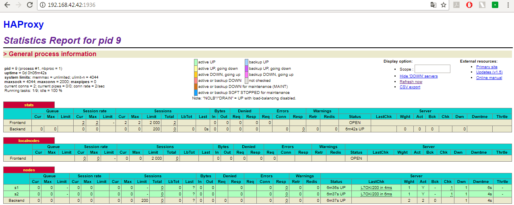
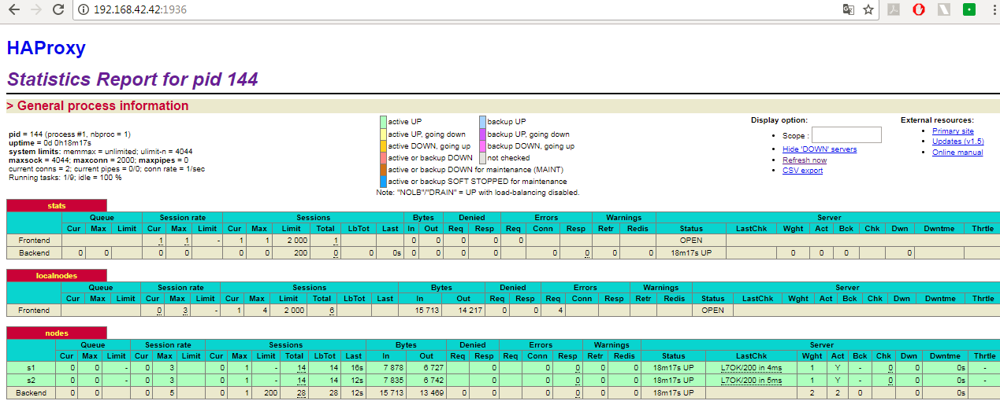
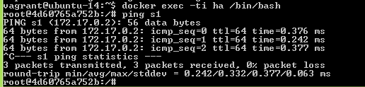
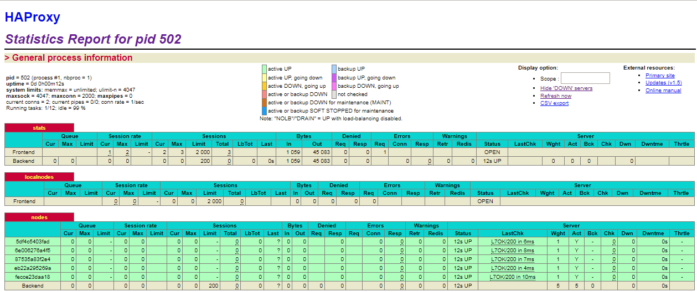

## Lab 4: DOCKER AND DYNAMIC SCALING ##
Group list : 

 * Lucie Steiner
 * Anastasia Zharkova

### Table of content ###
- [Introduction](#intro)
- [Task 0: Identify issues and install the tools](#task0)
- [Task 1: Add a process supervisor to run several processes](#task1)
- [Task 2: Add a tool to manage membership in the web server cluster](#task2)
- [Task 3: React to membership changes](#task3)
- [Task 4: Use a template engine to easily generate configuration files](#task4)
- [Task 5: Generate a new load balancer configuration when membership changes](#task5)
- [Task 6: Make the load balancer automatically reload the new configuration](#task6)
- [Difficulties](#difficulties)
- [Conclusion](#conclusion)

### <a name="intro"></a> Introduction ###
In this lab, we will update the architecture from the previous lab to make it more adapted for production environment. The aim of the lab is to make the load balancing process more dynamic.

### <a name="task0"></a> Task 0: Identify issues and install the tools ###

**[M1]** *Do you think we can use the current solution for a production environment? What are the main problems when deploying it in a production environment?*

No, because the current solution is static. In the base configuration there are only two containers, which would not be enough if the traffic increases. Launching new containers has to be done manually which would not be an acceptable solution for production environment. Moreover, if the servers crash randomly, killing the container and launching a new one would also have to be done manually. 

**[M2]** *Describe what you need to do to add new webapp container to the infrastructure. Give the exact steps of what you have to do without modifiying the way the things are done.*

We would have to build and run a new webapp container and add it in the haproxy configuration file. Then, we would have to restart the load balancer container, in order to have the new configuration.

**[M3]** *Based on your previous answers, you have detected some issues in the current solution. Now propose a better approach at a high level.*

The main problem is the number of containers is not dynamic. New containers have to be added manually. It is not possible to add new containers dynamically when the traffic increases and to launch a new container automatically when one crashes.

**[M4]** *You probably noticed that the list of web application nodes is hardcoded in the load balancer configuration. How can we manage the web app nodes in a more dynamic fashion?*

It should be possible to add/remove web servers dynamically. The nodes should communicate, so that they are aware when one node is down and a new one can be started.


**[M5]** *In the physical or virtual machines of a typical infrastructure we tend to have not only one main process (like the web server or the load balancer) running, but a few additional processes on the side to perform management tasks.*
*For example to monitor the distributed system as a whole it is common to collect in one centralized place all the logs produced by the different machines. Therefore we need a process running on each machine that will forward the logs to the central place. (We could also imagine a central tool that reaches out to each machine to gather the logs. That's a push vs. pull problem.) It is quite common to see a push mechanism used for this kind of task.*

*Do you think our current solution is able to run additional management processes beside the main web server / load balancer process in a container? If no, what is missing / required to reach the goal? If yes, how to proceed to run for example a log forwarding process?*

No, because there can be only one process per container. In order to have multiple processes running in one container, we need a process supervisor.

**[M6]** *In our current solution, although the load balancer configuration is changing dynamically, it doesn't follow dynamically the configuration of our distributed system when web servers are added or removed. If we take a closer look at the run.sh script, we see two calls to sed which will replace two lines in the haproxy.cfg configuration file just before we start haproxy. You clearly see that the configuration file has two lines and the script will replace these two lines.*

*What happens if we add more web server nodes? Do you think it is really dynamic? It's far away from being a dynamic configuration. Can you propose a solution to solve this?*

The part that adds a web server node is still hardcoded so it is not dynamic. When a new server is created, a new configuration file should be created automatically depending on the current state of the cluster and then loaded automatically.

**Deliverables:**


1. *Take a screenshot of the stats page of HAProxy at http://192.168.42.42:1936. You should see your backend nodes.*

 

2. *Give the URL of your repository URL in the lab report.*

https://github.com/asuto4ka/Teaching-HEIGVD-AIT-2016-Labo-Docker

### <a name="task1"></a> Task 1: Add a process supervisor to run several processes ###

**Deliverables:**

1. *Take a screenshot of the stats page of HAProxy at http://192.168.42.42:1936. You should see your backend nodes. It should be really similar to the screenshot of the previous task.*

 

  As we can see this screenshot is very similar to the one from the previous task, which means that adding the process supervisor did not have a negative impact on the system.

2. *Describe your difficulties for this task and your understanding of what is happening during this task. Explain in your own words why are we installing a process supervisor. Do not hesitate to do more research and to find more articles on that topic to illustrate the problem.*

	We did not really have any particular problems while doing this task, we only had problems in the beggining with fonctionning of vagrant. 

	In this task, we used S6, a process supervisor, to be able to run multiple processes in a container. We first had to add it to the Docker images, then configure it so that it is the main process in the containrer. Finally we has to put the web application and load balancer starting scripts in the right place, so that the S6 overlay that is in each of the Docker images can launch the corresponding application. Now that the process supervisor is installed, we will be able to run other processes in the containers.

### <a name="task2"></a> Task 2: Add a tool to manage membership in the web server cluster ###


 

**Deliverables:**

1. *Provide the docker log output for each of the containers: ha, s1 and s2. You need to create a folder logs in your repository to store the files separately from the lab report. For each lab task create a folder and name it using the task number. No need to create a folder when there are no logs.*

 - [Log output for ha](../logs/task2/ha.logs)
 - [Log output for s1](../logs/task2/s1.logs)
 - [Log output for s2](../logs/task2/s2.logs)


2. *Give the answer to the question about the existing problem with the current solution.*

	*Anyway, in our current solution, there is kind of misconception around the way we create the Serf cluster. In the deliverables, describe which problem exists with the current solution based on the previous explanations and remarks. Propose a solution to solve the issue.*

	The current problem could be that if Serf is unable to join with an address, the agent startup fails. The -retry-join option could allow to specify other agents to join, so that the agent startup does not fail if Serf fails to join with ha.

3. *Give an explanation on how Serf is working. Read the official website to get more details about the GOSSIP protocol used in Serf. Try to find other solutions that can be used to solve similar situations where we need some auto-discovery mechanism.*

	Serf uses a gossip protocol to communicate with the cluster. It can join an existing cluster or sart a new one. Then, it broadcasts gossip messages to the nodes in the cluster over UPD. It sometimes also uses TCP to get the state of a particular (random) node. This allows Serf to detect when a node fails. If Serf does not get a response from a node, it asks other nodes to try and contact it too. If this fails, then Serf sends a gossip message ot the cluster to tell that the node is "suspicious". If nothing new happens for some time, then Serf sends a gossip message to tell that the node is dead.

	Other solutions that could be used include Zookeeper, doozerd or etcd. Their architecture is different from Serf, as they do not use gossip, but a client/server architecture. However, they are much more complex than Serf.

### <a name="task3"></a> Task 3: React to membership changes ###

**Deliverables:**

1. *Provide the docker log output for each of the containers: ha, s1 and s2. Put your logs in the logs directory you created in the previous task.*

 	- [Log output for ha (only container running)](../logs/task3/ha_avant_s1.logs)
 	- [Log output for s1 (ha also running)](../logs/task3/s1.logs)
 	- [Log output for ha (after s1 started)](../logs/task3/ha_apres_s1.logs)
 	- [Log output for s2 (s1 and ha running)](../logs/task3/s2_apres_start_all.logs)


2. *Provide the logs from the ha container gathered directly from the /var/log/serf.log file present in the container. Put the logs in the logs directory in your repo.*

 	- [Log output for ha (from the /var/log/serf.log file)](../logs/task3/task3_cat.PNG)

### <a name="task4"></a> Task 4: Use a template engine to easily generate configuration files ###

**Deliverables:**

1. *You probably noticed when we added `xz-utils`, we have to rebuild the whole image which took some time. What can we do to mitigate that? Take a look at the Docker documentation on [image layers](https://docs.docker.com/engine/userguide/storagedriver/imagesandcontainers/#images-and-layers). Tell us about the pros and cons to merge as much as possible of the command. In other words, compare:*

  	```
  	RUN command 1
  	RUN command 2
  	RUN command 3
  	```

  	*vs.*

  	```
  	RUN command 1 && command 2 && command 3
  	```

	Docker uses cache to store the result of each command. If we have three RUN commands, there will be a request to the cache for each of these commands. If the three RUN commands are merged in one, there will be only one request to the cache. Another point is that each command in the dockerfile creates a new layer. Reducing the number of layers can also reduce the image size. The problem with this solution is that we are not using cache correctly. If one of the packages in the RUN commands has changed, the cache will not be used and everything will need tobe installed again.

	*There are also some articles about techniques to reduce the image size. Try to find them. They are talking about `squashing` or `flattening` images.*

	**flattening:** when a docker container is exported and then imported again, the history of the container is not preserved. This can be used to reduce the size of a container. The image itself cannot be flattened.
	Source: http://tuhrig.de/flatten-a-docker-container-or-image/

	**squashing:** the aim is to have an image with fewer and smaller layers. All of the layers beneath the initial FROM layer are squashed into a single layer. Other specific layers are also preserved.
	Source: http://jasonwilder.com/blog/2014/08/19/squashing-docker-images/

2. *Propose a different approach to architecture our images to be able to reuse as much as possible what we have done. Your proposition should also try to avoid as much as possible repetitions between your images.*

	We could create a base docker image with the layers that are needed in all our images. All our images would inherit this base image.

3. *Provide the `/tmp/haproxy.cfg` file generated in the `ha` container after each step.  Place the output into the `logs` folder like you already did for the Docker logs in the previous tasks. Three files are expected.*

 	- [HAProxy config file when ha started](../logs/task4/task4_start_ha.PNG)
 	- [HAProxy config file when s1 started](../logs/task4/task4_start_s1.PNG)
 	- [HaProxy config file when s2 started](../logs/task4/task4_start_s2.PNG)
   
	*In addition, provide a log file containing the output of the `docker ps` console and another file (per container) with `docker inspect <container>`. Four files are expected.*

	Unfortunately, the output of the docker ps command is missing. We forgot to save this output.

 	- [docker inspect ha](../logs/task4/ha_inspect.logs)
 	- [docker inspect s1](../logs/task4/s1_inspect.logs)
 	- [docker inspect s2](../logs/task4/s2_inspect.logs)
   
4. *Based on the three output files you have collected, what can you say about the way we generate it? What is the problem if any?*

	Nothing, we did not see any problem.

### <a name="task5"></a> Task 5: Generate a new load balancer configuration when membership changes ###

**Deliverables:**

1. *Provide the file /usr/local/etc/haproxy/haproxy.cfg generated in the ha container after each step. Three files are expected.*

 	- [HAProxy configuration file](../logs/task5/task5_last_one_haproxy.txt)

	Unfortunately, we have only one file because we only understood at the end of the task that we had to keep the files form each step.

	*In addition, provide a log file containing the output of the docker ps console and another file (per container) with docker inspect <container>. Four files are expected.*

 	- [docker ps](images/task5_docker_ps.PNG)
 	- [docker inspect ha](../logs/task5/ha_inspect.logs)
 	- [docker inspect s1](../logs/task5/s1_inspect.logs)
 	- [docker inspect s2](../logs/task5/s2_inspect.logs)

2. *Provide the list of files from the /nodes folder inside the ha container. One file expected with the command output.*

 	- [List of files from the nodes folder](images/task5_inside_ha_nodes.PNG)


3. *Provide the configuration file after you stopped one container and the list of nodes present in the /nodes folder. One file expected with the command output. Two files are expected. In addition, provide a log file containing the output of the docker ps console. One file expected.*

	- [HAProxy configuration file](../logs/task5/task5_last_one_haproxy.txt)

This file contains both the command output and docker ps output.


 	- [docker ps](images/task5_docker_ps-only_one.PNG)


4. *(Optional:) Propose a different approach to manage the list of backend nodes. You do not need to implement it. You can also propose your own tools or the ones you discovered online. In that case, do not forget to cite your references.*

### <a name="task6"></a> Task 6: Make the load balancer automatically reload the new configuration ###

**Deliverables:**

1. *Take a screenshots of the HAProxy stat page showing more than 2 web applications running. Additional screenshots are welcome to see a sequence of experimentations like shutting down a node and starting more nodes.*

	


	*Also provide the output of docker ps in a log file. At least one file is expected. You can provide one output per step of your experimentation according to your screenshots.*

 	- [docker ps](images/task6_docker_ps_5_nodes.PNG)


2. *Give your own feelings about the final solution. Propose improvements or ways to do the things differently. If any, provide references to your readings for the improvements.*

	This solution seems to be good enough for the context described in this lab. However, it would be better to find a solution that can change the configuration faster.

3. *(Optional:) Present a live demo where you add and remove a backend container.*

### <a name="difficulties"></a> Difficulties ###
During this lab, we had a lot of small difficulties that took us a lot of time to solve. The main one was with windows and ending lines. Although the fix was presented at the end of the lab, converting the file once was not enough. Every change in a file that involved ending lines resulted in steps not working, then the file needed to be converted again. Overall, the lab was quite long, with a lot of instructions to follow, a lot of files to manage, which created some confusion. Some of the TODOs also had quite similar names which led us to copy/paste lines to the wrong place. It required a lot of precision and attention to avoid mistakes, and when a mistake waas made it was very hard to find it. As no error was displayed, debuggig was the most difficult part of the lab. All of this resulted in some of the required log/configuration file/command output missing.


### <a name="conclusion"></a> Conclusion ###
This lab was a good opportunity to learn how to make a more advanced use of docker. It alspo helped us to understand how to use dynamic scaling. We learned how to have multiple process running in one container, how to make the nodes communicate in a cluster, react to the events like a node crashing by starting a new one and automatically update and load a new configuration for the load balancer.